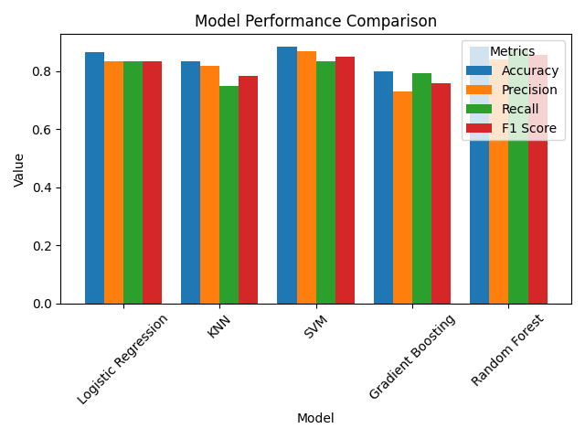

# Model Evaluation Results

## Individual Model Performance

### Random Forest
- Accuracy: 0.8833
- Precision: 0.8400
- Recall: 0.8750
- F1 Score: 0.8571

### Gradient Boosting
- Accuracy: 0.8000
- Precision: 0.7308
- Recall: 0.7917
- F1 Score: 0.7600

### SVM (Support Vector Machine)
- Accuracy: 0.8833
- Precision: 0.8696
- Recall: 0.8333
- F1 Score: 0.8511

### KNN (K-Nearest Neighbors)
- Accuracy: 0.8333
- Precision: 0.8182
- Recall: 0.7500
- F1 Score: 0.7826

### Logistic Regression
- Accuracy: 0.8667
- Precision: 0.8333
- Recall: 0.8333
- F1 Score: 0.8333

## Comparative Analysis

### Performance Metrics Table 

### Best Models by Metric
- **Accuracy**: SVM (0.8833)
- **Precision**: SVM (0.8696)
- **Recall**: Random Forest (0.8750)
- **F1 Score**: Random Forest (0.8571)

## Key Findings

1. **Top Performing Models**:
   - SVM and Random Forest showed the best overall performance
   - Both achieved the highest accuracy (0.8833)
   - SVM excelled in precision while Random Forest led in recall

2. **Model Strengths**:
   - **SVM**: Best for minimizing false positives (highest precision)
   - **Random Forest**: Best for minimizing false negatives (highest recall)
   - **Logistic Regression**: Showed balanced performance across all metrics

3. **Model Limitations**:
   - **Gradient Boosting**: Showed lower overall performance
   - **KNN**: Struggled with recall compared to other models

## Visualization

## MLflow Tracking Notes
- All models were tracked using MLflow
- Parameters and metrics were logged for each run
- Models were saved for future reference and deployment

## Technical Details
- Train-Test Split: 80-20
- Random State: 42
- Standardized Features using StandardScaler
- Binary Classification Task (Heart Disease: Present/Absent)

## Model Configurations

### Random Forest
- n_estimators: 100
- max_depth: 10
- random_state: 42

### Gradient Boosting
- n_estimators: 100
- max_depth: 5
- random_state: 42

### SVM
- kernel: rbf
- random_state: 42

### KNN
- n_neighbors: 5

### Logistic Regression
- default parameters
- random_state: 42 
